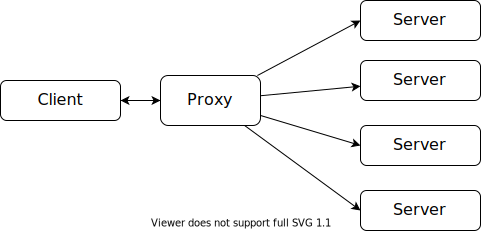
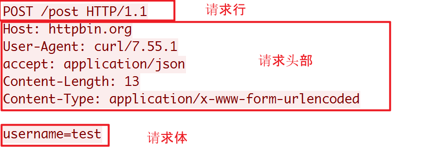
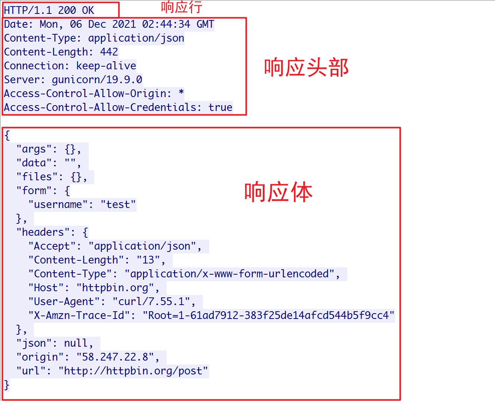
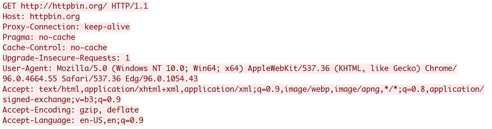
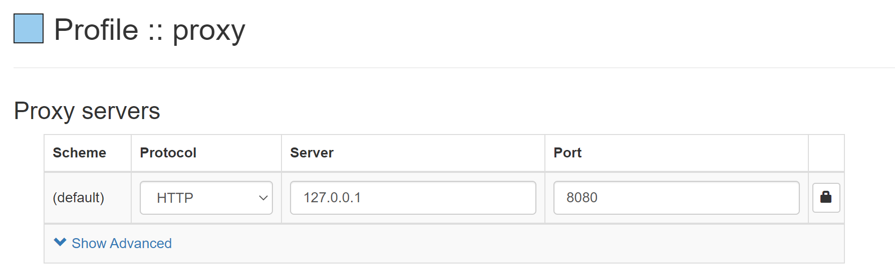

## HTTP Proxy

### 概念

首先我们来了解一下 `HTTP` 代理的相关概念，通常来说，有两类 `HTTP` 代理，一类是`正向代理`，一类是`反向代理`。

我们平时使用的 `VPN` 就是正向代理，我们指定一个服务器，然后通过正向代理去连接这个服务器获取内容


`Nginx` 是典型的反向代理服务器，可以用于负载均衡和缓存，我们不清楚服务器的地址，但是我们访问反向代理服务器的时候，它会自动为我们请求服务器，并且返回相应的内容。



> 总结：正向代理下，我们知道服务器的具体地址，反向代理下，我们只需要知道代理服务的地址，无需知道具体的服务端地址。

这里，我们讲述正向代理，首先先来简单的回忆一下 HTTP 协议吧。

### HTTP 协议

HTTP 基于传输层协议而搭建的应用层协议，其实 HTTP 请求和响应没有什么很神奇的部分，就是一个 `Client/Server` 模型，客户端通过套接字发送数据，服务端解析之后进行处理，然后返回响应。

这里只稍微介绍一下协议格式，想要了解更多的同学可以参考 [HTTP/1.1](https://www.rfc-editor.org/info/rfc2068)，下面的内容均通过 `wireshark` 抓包获得。

#### 请求

格式如下：



每一行均以 `\r\n` 结尾，请求体可以为空

#### 响应

格式如下：



每一行也是以 `\r\n` 结尾，响应体可以为空

> 请求和响应在格式上的主要区别在第一行，也就是请求行和响应行的内容不一致，此外，请求和响应的头部取值也有所区别，部分头部只用于请求，部分头部只由于响应，但是常见的绝大多数头部在响应和请求中均可使用。


我们如果要构造一个请求也很简单，创建一个套接字，然后发送上述格式的数据即可：

```go
// 连接服务器
conn, err := net.Dial("tcp", "httpbin.org:80")
if err != nil {
  fmt.Println("Dial tcp err: ", err)
  return 
}

// 构造请求
msg := strings.Builder{}
msg.WriteString("GET /get HTTP/1.1\r\n")
msg.WriteString("Host: httpbin.org\r\n")
msg.WriteString("Accept: application/json\r\n")
msg.WriteString("Connection: close\r\n")
msg.WriteString("\r\n")

// 发送内容
_, err = conn.Write([]byte(msg.String()))
if err != nil {
  fmt.Println("Send msg err: ", err)
  return 
}
```

同理，响应也是，这里不再赘述，读者可自行编写代码，也可以使用 `wireshark` 抓包测试。


### 正向代理实现

上面提到过，在正向代理下，我们会首先连接到代理服务器，然后代理服务会到服务器上请求对应的资源，那么我们身为代理服务器，如何知道客户端需要请求什么资源呢？

这到不同担心，客户端连接代理的时候，是有一定的规范的，不是说随便连，对于 `HTTP` 协议来说，请求代理服务器和请求普通的服务器大致相同，但是请求的路径一般会设置为绝对路径，比如为 `GET http://httpbin.org/ HTTP/1.1`，而不是 `GET / HTTP/1.1`，对于 `HTTPS` 来说，首先会通过 `CONNECT` 连接到代理服务器，接受到 `200` 响应之后才会发送实际的加密数据。

首先我们来考虑一下 `HTTP` 吧，下面是连接到服务器上的请求：



我们需要做的是获取到对应的服务器地址，也就是 `Host` 字段，将头部数据解析完成之后，获取该字段即可。

```go
type Request struct {
	Method  string
	Path    string
	Version string
	Headers http.Header
	Body    []byte
	raw     []byte  // 原始请求
}

func (r Request) Host() (string, bool) {
	if r.Headers.Get("Host") != "" {
		return r.Headers.Get("Host"), true
	}
	return "", false
}

func ParseRequest(conn io.Reader) (*Request, error) {
	br := bufio.NewReader(conn)
	// ...省略部分代码...

  // 解析请求头部
	for {
		line, err := br.ReadBytes('\n')
		if err != nil {
			if err == io.EOF {
				break
			}
		}
		req.raw = append(req.raw, line...)
		line = bytes.TrimSpace(line)
		// \r\n
		if len(line) == 0 {
			break
		}
		colon := bytes.IndexByte(line, ':')
    // Bytes2Str 将 []byte 转换成 string
		req.Headers.Add(byteconv.Bytes2Str(bytes.TrimSpace(line[:colon])), byteconv.Bytes2Str(bytes.TrimSpace(line[colon+1:])))
	}
	
    // ...省略部分代码...
    return req, nil
}
```

获取到服务端的地址之后，建立 `TCP` 连接，然后将请求发送过去

```go
if !strings.Contains(host, ":") {
	host += ":80"
}

server, err := net.Dial("tcp", host)
if err != nil {
    conn.Close()
    log.Println("Dial server failed: ", err)
    return
}

_, err = server.Write(request.Raw())
if err != nil {
    log.Println("Write server failed: ", err)
    conn.Close()
    server.Close()
    return
}
```

最后将响应返回给客户端，直接调用 `io.Copy` 即可

```go
tunnel(conn, server)

func tunnel(client net.Conn, server net.Conn) {
	go io.Copy(server, client)
	go io.Copy(client, server)
}
```

> 如果说，我们想对响应进行过滤或者其他的操作，我们应该进行解析，解析的过程和请求类似，如果需要过滤掉，则不将结果返回，返回一些错误码，比如 403 即可。

对于 `HTTPS` 协议来说其实也是差不多的，但是由于 HTTPS 采用 `SSL/TLS` 对数据进行加密，所以我们无法对其实际的请求进行解析，不过对 `CONNECT` 请求进行解析已经可以满足我们的需求了。

接受到 `CONNECT` 请求之后，我们首先应该返回 `2xx` 表示连接成功，然后将请求的数据原封不动的发送给服务端，服务端返回的也原封不动的返回给客户端，我们对其中的数据不关心，即使关心也解密不了。

```go
if request.Method ==  "CONNECT"{
    conn.Write([]byte("HTTP/1.1 200 OK\r\n\r\n"))
    tunnel(conn, server)
    return
}
```


### 进行测试
下载插件 `Proxy SwitchyOmega`，如果你使用 `Edge`，见 [这里](https://microsoftedge.microsoft.com/addons/detail/proxy-switchyomega/fdbloeknjpnloaggplaobopplkdhnikc)，如果你使用Google，见 [这里](https://chrome.google.com/webstore/detail/padekgcemlokbadohgkifijomclgjgif)

打开插件进行配置，如下


访问一个网址，比如`http://httpbin.org`，如果可以访问，那么说明代理服务器生效~


完整代码见 [GitHub](https://github.com/junhaideng/go-http-proxy)